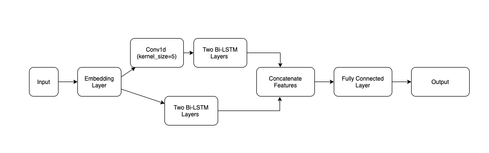

# MSBD6000H Covid19 NER

## Dependency
 - pytorch='1.8.0'
 - numpy
 - pandas
 - scikit-learn

## Model architecture
  

## To reproduce the results
In src/bilstm.py, set training_mode = False in config class  

```bash
cd src
python bilstm.py
```
The result is stored in 'test_pred.csv'   
